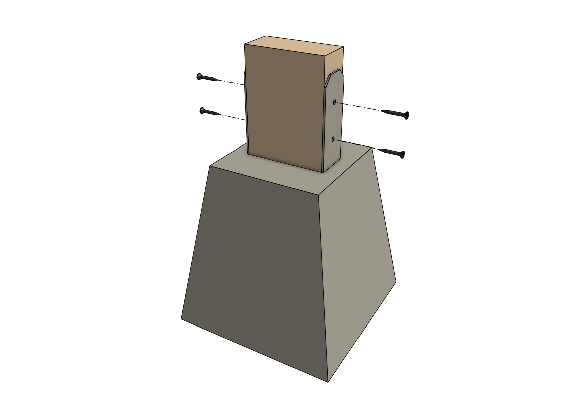

As an alternative to [building a full raised bed](raised-bed.md), you may consider mounting your FarmBot to **pier block supports**.

> **ℹ️ 2 hours:** 

# Step 1: Attach wood blocks to piers

Cut short **pressure treated wood blocks** for attaching to the **pier blocks**. Depending on the pier block you purchased, you may need to use 2x4" (45x90mm) or 4x4" (90x90mm) pieces of wood at a length between 100 and 150mm.

Attach each block to a pier using [[wood screws]] compatible with the pier block's bracket and rated for the outdoors.

# Step 2: Position the piers

Position the piers according to a diagram below for a maximally sized growing area for FarmBot Genesis or Genesis XL. You may also position the two tracks closer together if you are space constrained. **Keep in mind that the outer dimensions of your supporting infrastructure must not exceed [the maximum dimensions](raised-bed.md#maximum-raised-bed-size)**.

> **✅ Maintain access:** 

> **⚠️ Parallel or bust:** 

> **✅ Infrastructure complete!:** 

# What's next?

 * [Tracks](../tracks.md)
